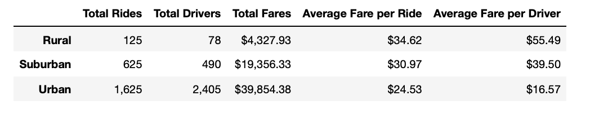
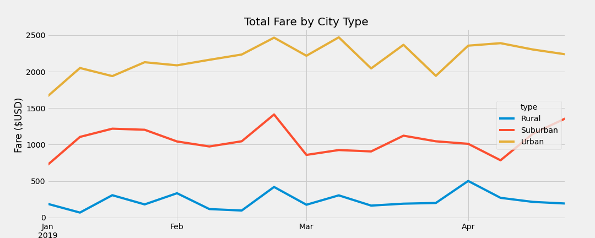

# PyBer Rideshare Analysis
## Overview of Analysis
* The purpose of this analysis was to analyze data from the rideshare company PyBer.
* With this data I created a Summary DataFrame of the data by City Type (Rural, Suburban, Urban).  The Summary DataFrame showed:
  * The Total Rides by City Type
  * Total Number of Drivers by City Type
  * Sum of Total Fares by City Types
  * Average Fare per Ride by City Type
  * Average Fare per Driver by City Type
* The second part of this analysis was that I used Pandas and Matplotlib to create a multiple line graph that shows the total weekly fares for each city type.
## Results
* Each city type had varying results when it came to the different data points that I analyzed.
* Below is the summary DataFrame that I created from that data:

### Data Summary Results
#### Rural Cities 
* Had the lowest total number of rides and drivers and sum of total fares.  
* However, Rural Cities had the highest Average Fare per ride and Average Fare per Driver
#### Urban Cities
* Had the highest total number of rides and drivers and sum of total fares
* Urban Cities had the lowest Average Fare per ride and Average Fare per Driver
#### Suburban Cities
* All of the data points for suburban cities fell between the Rural and Urban City data points.
#### Overall
* The data shows me that the higer the number of drivers and total rides in the city type, the lower the average fare per ride and average fare per driver
### Total Fare by City Type by Week Results
* Below is the line graph I created that shows the total fares by city types by week:

#### Findings
* This data showed me that all city types had the highest sum of total fares towards the end of Feb, then dropped the first week of March
* However Urban cities had the most ups and downs each week in March, which Rural and Suburban cities didn't have as big of variances by week in March
* Overall all of the city types had relatively stable total fares over the span of the months shown in the line graph

